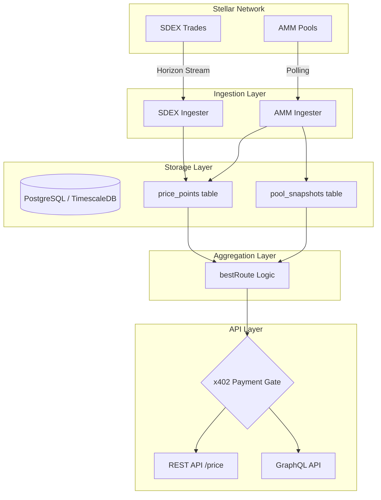

# Architecture Overview

Lens is a unified price aggregation engine for the Stellar network. It bridges the gap between Stellar's Classic Order Book (SDEX) and Liquidity Pools (AMM) by providing a single source of truth for asset pricing, VWAP calculations, and optimal trade routing.

## Data Flow

The following diagram illustrates how data flows from the Stellar network through our ingesters, into the database, and finally out through our API layers.

## System Components

### 1. Ingestion Layer
Lens utilizes two distinct ingestion strategies to maintain up-to-date pricing data:

*   **SDEX Ingester**: Streams trades directly from Stellar Horizon for watched asset pairs. It processes individual trade events in real-time, extracting price and volume data which is then persisted to the `price_points` table.
*   **AMM Ingester**: Polls Horizon for liquidity pool snapshots and recent AMM trades. It stores pool reserves (Asset A/B amounts) in `pool_snapshots` and individual trades in `price_points`. This allows Lens to calculate spot prices based on reserve ratios even when no trades have occurred recently.

### 2. Storage Layer
Data is stored in a PostgreSQL database optimized with TimescaleDB for time-series efficiency.
*   **`price_points`**: A unified table for all trade events across both SDEX and AMM. This enables high-performance VWAP (Volume Weighted Average Price) calculations over various time windows (1m, 5m, 1h, 24h).
*   **`pool_snapshots`**: Stores the reserve state of AMM liquidity pools, which is critical for slippage estimation and constant-product price calculations.

### 3. Aggregation & Routing (`bestRoute`)
When a price is requested, the `bestRoute` engine compares the available liquidity on both SDEX and AMM:
*   **SDEX Pricing**: Fetches real-time path payment quotes from Horizon to determine the effective rate for a specific trade size.
*   **AMM Pricing**: Uses the constant-product formula (`x * y = k`) against the latest pool snapshots to estimate the output and slippage.
*   **Optimal Routing**: Compares the rates and recommends the best execution path (SDEX, AMM, or a SPLIT for large orders) to minimize slippage for the user.

### 4. API Layer & x402 Payment Gate
The system exposes both REST and GraphQL interfaces. To monetize the high-fidelity data, Lens implements the **x402 protocol**.

The **x402 Payment Gate** is a middleware that intercepts requests to premium endpoints (like `/price`, `/pools`, and `/candles`). If a valid `x-payment` header containing a signed Stellar transaction is not present, the server returns a `402 Payment Required` status along with the payment requirements (price, destination address, and network). This ensures that every high-value API call is backed by a micropayment, enabling a "pay-per-query" business model.
